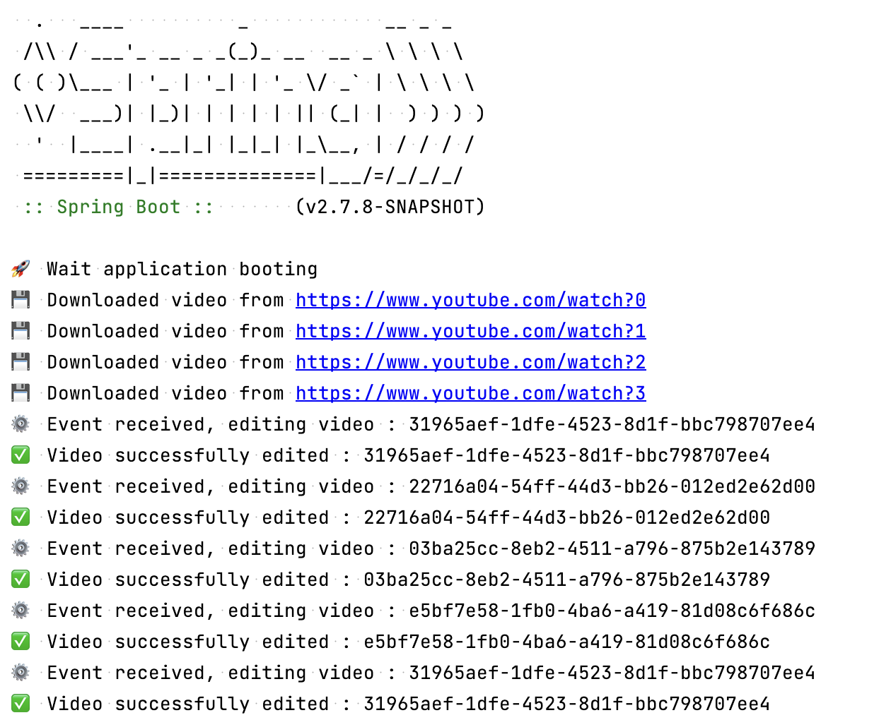

## ✉️ Basic implementation of Apache Kafka to understand how it works.

https://excalidraw.com/#json=Rv9zQKsSZ_Z8aMCGeoVYo,McvJox9CYJlr0WYc9CSYnQ

1. Send event for each video downloaded
2. Receive video downloaded event
3. Edit video and send video ready event
4. Receive video ready event
5. Send video ready notification event to user

## 📝 Notes

- The project is a Spring Boot application
- The project is a Maven project
- The project is a Java 11 project
- It uses Spring Kafka
- There is a docker-compose file to start a Kafka cluster
- It doesn't really download or edit videos, it just sends events
